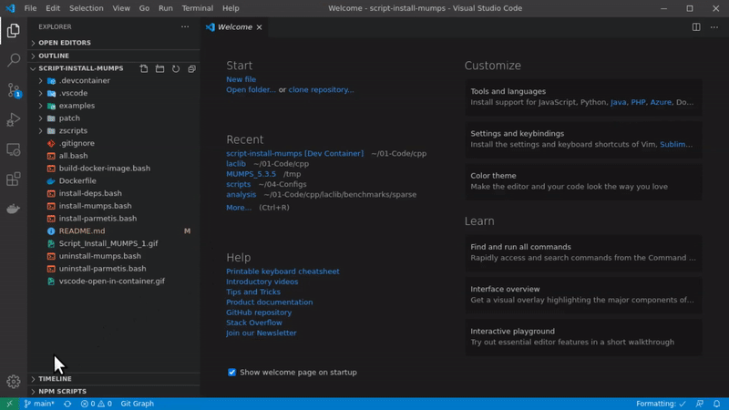

# Linear systems with UMFPACK and matrix market

This code solves linear systems with UMFPACK solver and matrices from Matrix Market.

You may install UMFPACK locally or use a Docker container as explained in the next section.

**Note:** Tested on Ubuntu 23.04.

## Local Installation

**1 Install UMFPACK**

```bash
sudo apt-get install libsuitesparse-dev
```

**2 Run Examples**

```bash
bash ./all.bash
bash ./compare-1-and-2.bash
```

## Using Docker

You may use an existent image from `cpmech` or build the Docker image yourself (see script `docker-build-image.bash`).

Fetch the Docker image:

```bash
docker pull cpmech/umfpack-matrix-market
```

### Directly run the code in a temporary container

```bash
docker run --rm -it cpmech/umfpack-matrix-market:latest /bin/bash
bash ./all.bash
bash ./compare-1-and-2.bash
```

### Use VS Code Docker extension

When using VS Code, the extension [ms-vscode-remote.remote-containers](https://marketplace.visualstudio.com/items?itemName=ms-vscode-remote.remote-containers) is recommended.

**1 Reopen this folder in a container**



**2 Run Examples**

Open a terminal within VS Code (with the container loaded) and type:

```bash
bash ./all.bash
bash ./compare-1-and-2.bash
```

## Results

### Compare 1 vs 2

Note:

1. `1` refers to `pressurized-cylinder-linear-elastic-symmetric-1.mtx` which is the global stiffness matrix of a finite element analysis of a pressurized cylinder modelled by linear elasticity.
1. `2` refers to `pressurized-cylinder-linear-elastic-symmetric-2.mtx` is very similar to matrix `1`, however was created by a slightly finer mesh.

Results (output of `./compare-1-and-2.bash`):

```text
... FILE: pressurized-cylinder-linear-elastic-symmetric-1.mtx
... UMFPACK V5.7 (Oct 20, 2019) demo: _di_ version
... SUCCESS: matrix loaded
... SUCCESS: CSC arrays allocated
... SUCCESS: COO converted to CSC
... SUCCESS: symbolic factorization completed
... SUCCESS: numeric factorization completed
... SUCCESS: solution calculated
... max_norm of residual: 5.00222e-12
... max_diff using COO  : 5.00222e-12
... SUCCESS: numerical solution is within tolerance


... FILE: pressurized-cylinder-linear-elastic-symmetric-1.mtx
... ENFORCING UNSYMMETRIC STRATEGY
... UMFPACK V5.7 (Oct 20, 2019) demo: _di_ version
... SUCCESS: matrix loaded
... SUCCESS: CSC arrays allocated
... SUCCESS: COO converted to CSC
... SUCCESS: symbolic factorization completed
... SUCCESS: numeric factorization completed
... SUCCESS: solution calculated
... max_norm of residual: 1.09071e-05
... max_diff using COO  : 1.09071e-05
... FAIL: the error is too high


... FILE: pressurized-cylinder-linear-elastic-symmetric-2.mtx
... UMFPACK V5.7 (Oct 20, 2019) demo: _di_ version
... SUCCESS: matrix loaded
... SUCCESS: CSC arrays allocated
... SUCCESS: COO converted to CSC
... SUCCESS: symbolic factorization completed
... SUCCESS: numeric factorization completed
... SUCCESS: solution calculated
... max_norm of residual: 5.05906e-12
... max_diff using COO  : 5.05906e-12
... SUCCESS: numerical solution is within tolerance


... FILE: pressurized-cylinder-linear-elastic-symmetric-2.mtx
... ENFORCING UNSYMMETRIC STRATEGY
... UMFPACK V5.7 (Oct 20, 2019) demo: _di_ version
... SUCCESS: matrix loaded
... SUCCESS: CSC arrays allocated
... SUCCESS: COO converted to CSC
... SUCCESS: symbolic factorization completed
... SUCCESS: numeric factorization completed
... SUCCESS: solution calculated
... max_norm of residual: 4189.11
... max_diff using COO  : 4189.11
... FAIL: the error is too high
```

When enforcing the `unsymmetric strategy`, the norm of the residual increases from `1.09071e-05` to `4189.11` when going from matrix `1` to matrix `2`.
